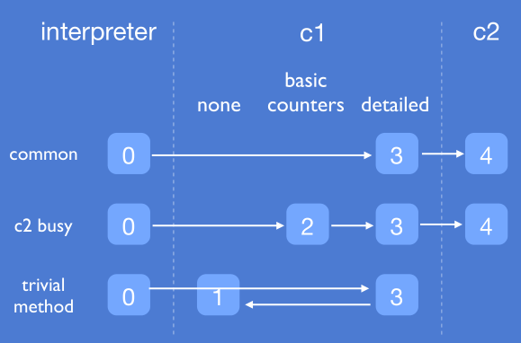
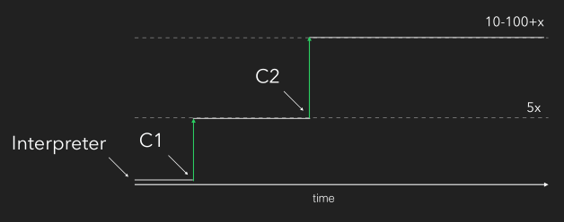
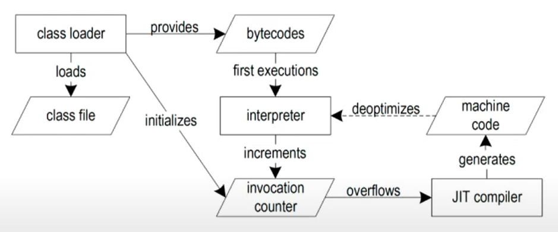

[](https://www.gnu.org/licenses/gpl-3.0)

# jit-notes
* references
    * [JVM JIT for Dummies](https://www.youtube.com/watch?v=0Yud4Q2HEz4)
    * [Douglas Hawkins — Understanding the Tricks Behind the JIT](https://www.youtube.com/watch?v=oH4_unx8eJQ)
    * [JVM Mechanics by Douglas Hawkins](https://www.youtube.com/watch?v=a-U0so9FfqQ)
    * [Devoxx Poland 2016 - Douglas Hawkins - A Peak Inside the JIT](https://www.youtube.com/watch?v=6ICU2xo427M)
    * [Understand the Trade-offs of Using Compilers for Java Applications](https://www.youtube.com/watch?v=C_dV3LQY9TA)
    * [Toruń JUG #29 - "JIT me baby one more time" - Jarek Pałka](https://www.youtube.com/watch?v=GXyM7IOTXOM)
    * [WJUG #257 - Krzysztof Ślusarski - Just-In-Time compiler - ukryty "przyjaciel"](https://www.youtube.com/watch?v=f8zaYDJctTA)
    * [An Introduction to JVM Performance](https://www.youtube.com/watch?v=hjpzLXoUu1Y)
    * [Douglas Hawkins playlist](https://www.youtube.com/playlist?list=PLDnxsaeAegRduDndE6P1MUYRFYoYhGvsV)
    * [Twitter's quest for a wholly Graal runtime - Voxxed Days Singapore 2019](https://www.youtube.com/watch?v=TbUahT0jet0)
    * https://stackoverflow.com/questions/56698783/what-is-the-difference-between-java-intrinsic-and-native-methods
    * https://stackoverflow.com/questions/9105505/differences-between-just-in-time-compilation-and-on-stack-replacement
    * https://www.slideshare.net/dougqh
    * https://blog.takipi.com/java-on-steroids-5-super-useful-jit-optimization-techniques/
    * https://blog.codecentric.de/en/2012/07/useful-jvm-flags-part-1-jvm-types-and-compiler-modes/
    * https://blog.joda.org/2011/08/printcompilation-jvm-flag.html
    * https://medium.com/@julio.falbo/understand-jvm-and-jit-compiler-part-2-cc6f26fff721
    * https://stackoverflow.com/questions/36955433/how-does-the-jvm-know-when-to-throw-a-nullpointerexception
    * https://vlab.cs.ucsb.edu/papers/jitleaks.pdf
    * https://advancedweb.hu/jvm-jit-optimization-techniques/

## general
* JIT - just in time compiler
* "JIT is just complex pattern matchers" - Douglas Hawkins
* a technique of code compilation during runtime
    * first usage: LISP
    * code is compiled to something intermediary (bytecode) and then is compiled to native code 
    (machine code) during runtime
* opposed to Ahead Of Time (AOT) compilation: C, C++, Go, Rust
    * compilation: directly to machine code
    * many optimizations during compilation
    * restart - we start from the beginning
    * java 9 - AOTC compiler
* loop of JIT compilation: interpret -> profile -> compile -> deoptimize -> interpret
* optimizes two things: methods and loops
* big part of JVM
    * C2 - 19%
    * C1 - 6,3%
    * gc - 15%
* useful flags
    * `-Xint` - flag forces the JVM to execute all bytecode in the interpreted mode, which comes along with a 
    considerable slowdown, usually factor 10 or higher
    * `-XX:+PrintCompilation` - show basic information on when Hotspot compiles methods
        * shows timespan from start-up to compilation
        * shows compilation identifier (each compilation bumps identifier by 1)
            * C1 and C2 have separate identifiers
* hot spots - programming parts that are executed a lot
    * spring configuration classes - only once during bootstrap
    * rest controller methods - many times
* jit compilers consume transient resources (CPU cycles and memory)
    * from under a millisecond to seconds of compile time
    * can allocate 100s MBs
    * takes time to get to "full speed" because there may be 1000s of methods to compile
    * possible stop-the-world events, especially during deoptimization
* collecting profile data is an overhead
    * cost usually paid while code is interpreted: slows start-up and ramp-up

## mechanics
* tiered

    
    
    * C2 compilation time is nearly 4 times slower than C1, but the code is 2-10x faster than C1
* counters

    
    * hot method: invocation counter > invocation threshold
    * hot loops: backedge (loop) counter > backedge threshold
        * backedge (loop) counter - number of already happened iterations
    * invocation + backedge counter > compile threshold
        * medium hot methods with medium hot loops
    * if counter > threshold -> compile loop
    * C1: 2000 invocations
    * C2: 10000 invocations
* Compiler Task Queue
    * JIT compilation is an asynchronous process
    * when the JVM decides that a certain block of code should be compiled, that block of code is put in a queue
        * not strictly first in, first out
            * methods whose invocation counters are higher have priority
    * the JVM will continue interpreting the method, and the next time 
    the method is called, the JVM will execute the compiled version of the method
    * if method stays in a queue for too long - it will be removed from the queue
        * maybe we don't need optimization for that method anymore
    * on-stack replacement (OSR) context
        * consider a long-running loop
        * JVM needs the ability to start executing the compiled version of the loop while 
        the loop is still running
        * when the code for the loop has finished compiling, the JVM replaces the code (on the stack), and the 
        next iteration of the loop will execute the much faster-compiled version of the code
* deprecating old optimizations
    * made not entrant
        * there could exist many compilations of a single method simultaneously
        * if methodA calls methodB, it wants to have the best compilation
            * first time - it asks Call Dispatcher for the best compilation
                * methodA caches that information
        * subsequent calls
            * if the methodB is made not entrant - methodA calls dispatcher and gets the best compilation
            * if the methodB is not yet made not entrant - we have two compilations in the memory
                * we have to accept the slower compilation
                * somewhere in the meantime dispatcher will mark our compilation as made not entrant and 
                redirect calls to the faster one
    * made zombie - method was made not entrant and no thread has it on its stack
        * could be removed
### c1
* fast
* trivial methods, up to 6 bytes (MaxTrivialSize) are inlined by default
    * up to 35 bytes (in bytecode) (MaxInlineSize)
    * inlining depth limit: 9 methods deep

### c2
* slow but generates faster code (compared to C1)
* very complex
* learning curve way too steep
* the last few years no new major optimization
* reached its end-of-life already years ago
* by default limited by bytecode size of 325 (FreqInlineSize)
    * if > 8000 bytecode - always interpreted

## optimizations
* golden rule of optimization: don't do unnecessary work
* it is almost never a single optimization but a sequence of optimizations

    ```
    public static void x(Object object) {
        if (object == null) {
            System.out.println("a");
        }
    }

    public void y() {
        x(this);
    }
    ```
    inlining:
    ```
    public void y() {
       if (this == null) {
           System.out.println("a");
       }
    }
    ```
    null-check folding:
    ```
    public void y() {
       if (false) {
           System.out.println("a");
       }
    }
    ```
    death code termination:
    ```
    public void y() { } // method could be removed
    ```
* performs speculative optimizations / optimistic compilation
    * resulting optimized code assumes that the rarely-taken branch or dispatch will 
    never execute, and the missing code is replaced by a trap that is triggered if 
    the rare case should occur
        * known as an uncommon trap
* method inlining
    * expanding optimizations horizon
    * mother of all optimizations
    * "if you remove every other optimization java will be very fast anyway" - Joshua Bloch
    * tuning
        * -XX:+MaxTrivialSize=6 // trivial methods are inlined by default
        * -XX:+MaxInlineSize=35
        * -XX:+MaxInlineLevel=9
        * -XX:+MaxRecursiveInlineLevel=#
    * class hierarchy analysis
        * when dispatching a method call, the JVM checks how many implementations of that method is
            * 1: it’s called monomorphic dispatch
            * 2: it’s called bimorphic dispatch
            * more: it’s called megamorphic dispatch
        * monomorphic and bimorphic method calls can be inlined, while megamorphic calls can not
            ```
            abstract class AMF {
                abstract double apply(double i);
            }
            
            class CosF / SinF / SqrtF extends AMF {
                double apply(double i) {
                    return Math.cos / sin / sqrt (i)
                }
            }
            
            static double dol(AMF func, double i) {
                return func.apply(i);
            }
            ```
            if classloader loaded only SinF - JIT could do inlining
            ```
            static double dol(AMF func, double i) {
                return Math.sin(i);
            }
            ```
* constant folding and propagation
    ```
    public static long x() {
        int x = 14;
        int y = 7 - x / 2;
        return y * (28 / x + 2);
    }
    ```
    compiled into
    ```
    public static long x() {
        return 0;
    }
    ```
* loop unrolling
* lock coarsening/eliding
* coarsening
    ```
    public void needsLocks() {
        loop {
            process()
        }
    }
    private synchronized String process(String option) { }  
    ```
    compiled into
    ```
    public void needsLocks() {
        synchronized(this) {
            loop {
                // inlined process()
            }
        }
    }
    ```
* eliding
    ```
    public void elide() {
        var l = new ArrayList();
        synchronized(l) { // lock on local variable
            loop {
                 l.add(...) // l never escapes this thread
            }
        }
    }
    ```
    compiled into
    ```
    public void elide() {
        var l = new ArrayList();
        loop {
            l.add(...)
        }
    }
    ```
* dead code elimination
* duplicate code elimination
* escape analysis
    ```
    public void x() {
        var f = new Foo("X", "Y");
        baz(f)
    }
  
    public void baz(Foo f) {
        sout(f.a)
        sout(",")
        quux(f)
    }
    
    public void quux(Foo f) {
        sout(f.b)
        sout("!")
    }
    ```
    compiled into
    ```
    public void x() { // don't bother allocating foo object
        sout("X")
        sout(",")
        sout("Y")
        sout("!")
    }
    ```
* intrinsic
    * JVM knows the implementation of an intrinsic method and can substitute the original java-code with 
    machine-dependent well-optimized instructions (sometimes even with a single processor instruction)
    * known to the jit
    * don't inline bytecode, do insert "best" native code
        * e.g. kernel-level memory operation
        * e.g. optimized sqrt in machine code
    * common intrinsics
        * String#equals
        * most Math methods
            * `@HotSpotIntrinsticCandidate` - extremely popular in that package
        * System.arraycopy - 4 assembler instructions without a loop
        * Unsafe.storeFence - calls directly CPU instruction
        * Unsafe.allocateInstance - create instance bypassing constructor
        * Object#hashCode
        * Object#getClass
* NullPointerException digression
    * JVM implement the null check using virtual memory hardware
        * JVM arranges that page zero in its virtual address space is mapped to a page that 
        is unreadable + unwritable
        * since null is represented as zero, when Java code tries to dereference null this will try 
        to access a non-addressible page and will lead to the OS delivering a "segfault" signal to the JVM
        * JVM's segfault signal (SEGV) handler could trap this, figure out where the code was executing,
        and create and throw an NPE on the stack of the appropriate thread
        * without this, every deref should be guarded
            ```
            public static int getSize(Collection collection) {
                if (collection == null) { // othervise checks like that should be added during compilation
                    throw new NullPointerException();
                }
                return collection.size(); // assembler: segmentation violation
                // will crush JVM
            }
            ```
## deoptimizations
* deoptimization
    * when speculation fails, caught by uncommon trap
    * when CHA (class hierarchy analysis) notices change in class hierarchy
    * when method is no longer "hot", profile traces method frequency invocation
        * not only counters matters, but frequency of call
* stop the world events
* example - class hierarchy analysis deoptimization
    ```
    static double dol(AMF func, double i) { // AMF implementations: SinF
        return Math.sin(i); // inlined as monomoprhic call
    }
    ```
    * suppose that classloader loads another AMF implementation: CosF
        * JIT has to invalidate all methods optimized based on CHA
        * but simply loading a class by classloader doesn't mean that the class will be used
            ```
            static double dol(AMF func, double i) {
                if (func instanceof SincF)
                    return Math.sin(i);
                else uncommon_trap;
            ```
            when we start to use CosF - we trigger the uncommon trap and decompilation
            ```
            static double dol(AMF func, double i) {
                if (func instanceof SincF)
                    return Math.sin(i);
                else if (func instanceof CosF)
                    return Math.cos(i);
                else uncommon_trap;
            ```

## preferences
* jit likes
    * normal code
    * small methods
    * immutability
    * local variables
* jit doesn't like
    * weird code
    * big methods
    * mutability
    * native methods

## tools
* https://github.com/AdoptOpenJDK/jitwatch
    * log analyser and visualiser for the HotSpot JIT compiler.
    
